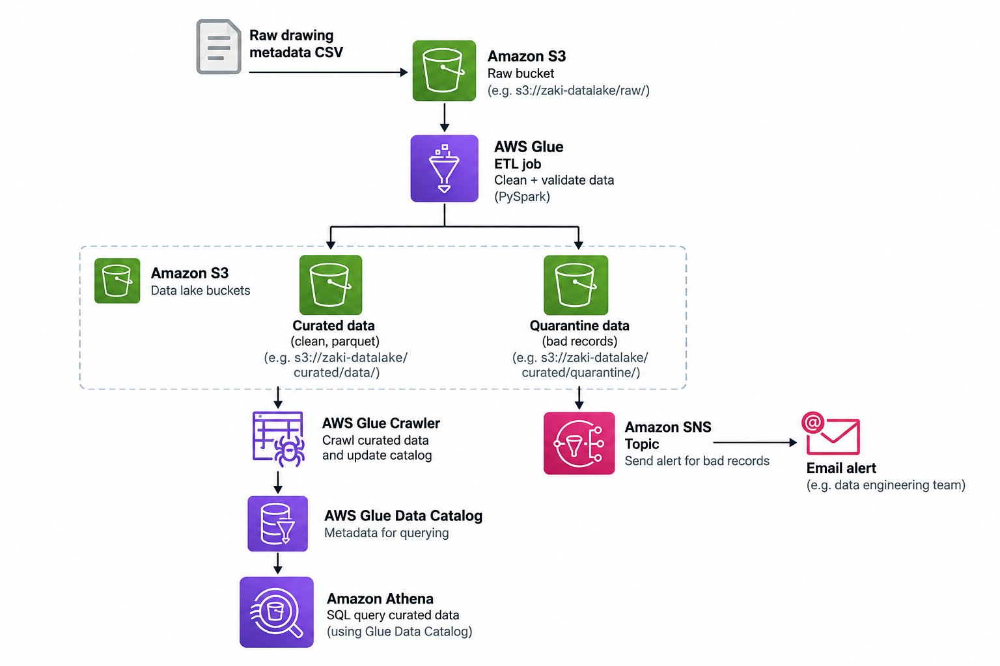
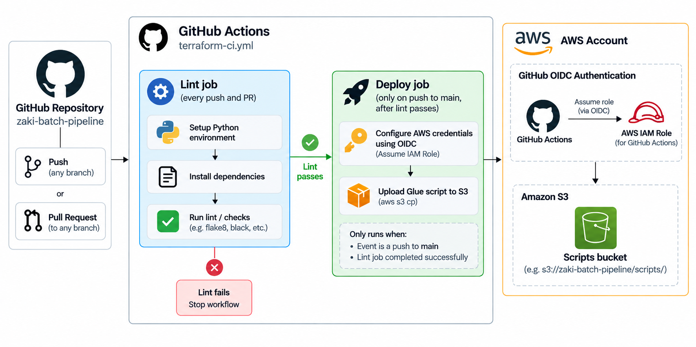

# zaki-batch-pipeline

A serverless AWS batch ETL pipeline that ingests raw manufacturing drawing metadata, cleans and validates it, and makes it queryable with SQL — built directly with the AWS CLI (no infrastructure-as-code), with a scripted, idempotent setup for reproducibility and a CI/CD pipeline for the pipeline's own code. 

## 1. Project overview

Raw CSV files describing engineering drawing revisions (drawing number, client, status, approvals, etc.) land in S3. An AWS Glue PySpark job reads them, runs a data-quality check, separates clean records from bad ones, and writes the clean data to a curated, partitioned Parquet dataset. A Glue Crawler catalogs that curated data so it can be queried directly with SQL via Amazon Athena — no database to load data into. Bad records are quarantined separately and trigger an email alert via SNS. The pipeline's own script is linted and deployed automatically by GitHub Actions, authenticated to AWS via OIDC rather than stored credentials.

## 2. Architecture






**Why this shape:**

- **Four single-purpose S3 buckets** (`raw`, `curated`, `scripts`, `athena-results`), not one shared bucket — each has exactly one job, so an IAM role scoped to one bucket physically cannot reach the others. The `scripts` bucket in particular exists so the CI/CD role's blast radius is limited to "can overwrite the ETL script," nothing else.
- **AWS Glue (ETL job)** — a managed, serverless Spark environment. No cluster to provision or patch; the job runs on-demand and scales automatically.
- **Data quality built into the pipeline itself, not bolted on after** — the Glue job flags rows with missing required fields or duplicate `(drawing_number, revision)` pairs, quarantines them separately from the clean output, and fails the whole job if more than 10% of records are bad (rather than silently shipping corrupted data downstream).
- **Glue Crawler + Data Catalog** — the crawler inspects the curated Parquet files and automatically infers the table schema and partition structure, registering it in the Glue Data Catalog so Athena can query it without any data movement.
- **Amazon Athena** — serverless SQL directly over S3, no database provisioning or data loading required.
- **SNS + email alerting** — a pipeline that fails or produces bad data silently is worse than one that's loud about it.

## 3. How this was built, and how to reproduce it

Every resource in this project was created directly with the AWS CLI — a specific, explainable command per resource, giving a clear picture of exactly what each piece of infrastructure does and why it's configured the way it is.

To keep that reproducible rather than something only recreatable by manually re-typing dozens of commands, every one of them has been captured into a single idempotent PowerShell script: [`setup/setup.ps1`](setup/setup.ps1). It checks whether each resource already exists before creating it, so it's safe to run more than once, and running it end-to-end recreates the entire stack — buckets, IAM roles, the Glue job, the Data Catalog database, the crawler, and the Athena workgroup configuration.

## 4. IAM & security design

Every IAM role in this project is scoped to the minimum it needs — least privilege as a deliberate design principle, not an afterthought:


The CI role authenticates via **OIDC**, not a stored AWS access key: GitHub Actions presents a short-lived, signed identity token that AWS exchanges for temporary credentials scoped to this one specific repository (enforced via the trust policy's `sub` condition), removing the risk of a long-lived credential leaking from GitHub Secrets.

## 5. CI/CD

Defined in [`.github/workflows/ci.yml`](.github/workflows/ci.yml). Two jobs:

1. **`lint`** — runs on every push and pull request that touches `src/**` or the workflow file itself: a Python syntax check (`python -m py_compile`) on the Glue script.
2. **`deploy`** — runs only on a push to `main` (not on pull requests), and only after `lint` passes: uploads the script to the `scripts` bucket via OIDC-authenticated `aws s3 cp`.

This follows a standard CI/CD safety pattern: a pull request only ever triggers the safe, read-only check (`lint`); the action that actually changes something (`deploy`) requires merging into `main` first.

## 6. What broke, and what it taught

Documenting this honestly rather than presenting a pipeline that "just worked":

- **Small-files problem.** The curated output was originally partitioned by `year/month/day`, which — combined with ~150 drawings spread randomly across 2.5 years — produced ~150 near-empty (~4KB) Parquet files. Diagnosed as a well-known real-world anti-pattern (excessive query-engine overhead from too many tiny files at scale) and fixed by coarsening the partitioning to `year/month`, reducing the output to 29 well-sized files.
- **Missing `s3:DeleteObject` permission.** The Glue job's IAM role could write to the curated bucket but not overwrite existing objects — invisible on the first run (nothing existed yet to delete), but broke the second run, since Spark's `overwrite` write mode deletes existing output before writing new output. Fixed by adding the missing permission — a real example of least-privilege IAM being iterative: grant what looks sufficient, let the system reveal what's actually needed.
- **CI role ARN pointed at a placeholder account.** While sanitizing the repo to avoid publishing the real AWS account ID, the workflow file was left with a fake account number baked directly into the IAM role ARN — which broke the actual OIDC authentication, since the role genuinely didn't exist at that ARN. Fixed by moving the real ARN into a GitHub Actions repository variable (not visible on a public repo) and referencing it via `${{ vars.AWS_ROLE_ARN }}`, solving privacy and functionality at once.
- **CI trigger path filter excluded the workflow file itself.** The workflow's `paths: src/**` filter meant edits to `ci.yml` never triggered a new run — silently masking whether a fix had actually been tested. Fixed by adding `.github/workflows/**` to the trigger paths.

## 7. A note on account IDs in this repo

Any AWS account ID visible in this repository's files (e.g. `123456789012` in `ci.yml`, `AlertEmail` parameters, etc.) is a placeholder, not the real account used to build and test this project. The real deploy role ARN is stored as a private GitHub Actions repository variable, not committed to source.

## 8. Prerequisites & running this yourself

To recreate this pipeline in your own AWS account:

- An AWS account with permissions to create the resources described above
- AWS CLI, configured (`aws configure`)
- PowerShell (the setup script is written for PowerShell; a `.sh` port would need equivalent syntax for JSON-to-file handling)

```powershell
cd setup
.\setup.ps1 -AlertEmail "your-email@example.com"
```

This recreates every AWS resource end-to-end. Once it completes, run the pipeline and populate the Data Catalog:

```powershell
aws glue start-job-run --job-name zaki-batch-pipeline-clean-drawings
aws glue start-crawler --name zaki-batch-pipeline-drawings-crawler
```

For the CI/CD workflow to authenticate in your own fork, you'd additionally need to create your own GitHub OIDC provider and IAM role trusting your fork's repository (see Section 4), and add its ARN as a repository variable named `AWS_ROLE_ARN`.